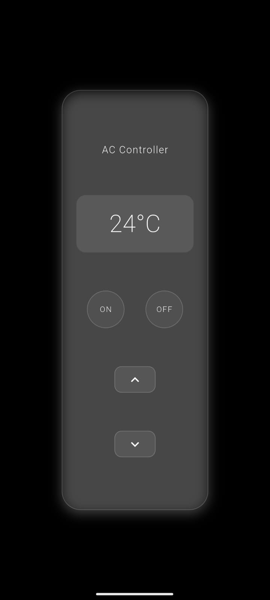
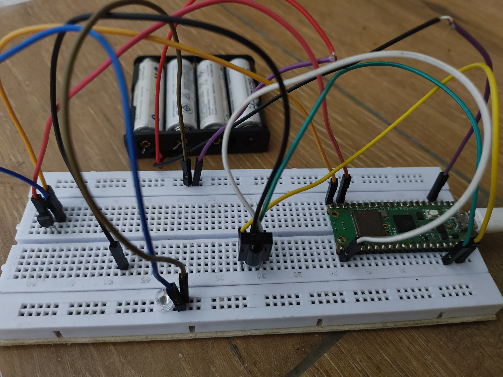
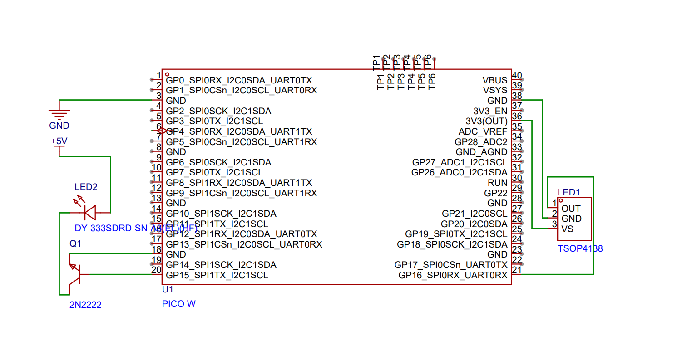

# 📡 Remote-X

**Remote-X** is an open-source universal remote system that combines Flutter, Firebase, and Raspberry Pi Pico to control IR-based devices (like ACs, TVs, etc.). The project aims to provide a smart, flexible, and customizable IR remote system that works across platforms.

---

## 🚀 Features

- 📱 Flutter-based mobile app interface
- 🔌 Raspberry Pi Pico for IR signal transmission
- ☁️ Firebase integration for cloud command sync
- 🔄 JSON-based remote configuration
- 🧪 Test tools for IR code validation
- 🔧 Simple backend API to bridge the app and Pico

---

## 📸 App Preview





---

## 🔌 Hardware Setup



---

## 📊 Circuit Diagram



---

## 📂 Project Structure
```
remote-x/
│
├── backend_api/ # Python backend API (Flask + Firebase)
│ └── app.py
│
├── pico_code/ # Raspberry Pi Pico scripts
│ ├── main.py
│ ├── remote_config.json
│ └── single_checker.py
│
├── flutter_app/ # Flutter frontend app
│ ├── lib/
│ ├── assets/
│ ├── pubspec.yaml
│ └── android/ios/web/..
```
---

## ⚙️ Setup Instructions

### 🔧 Backend API

1. Navigate to `backend_api`:
   ```bash
   cd backend_api
   pip install -r requirements.txt
   ```
2. Add your Firebase service key (serviceAccountKey.json) — do NOT upload this to GitHub.

3. Run the server:
    ```python
   python app.py
   ```

💡 Pico IR Controller
* Flash MicroPython to your Raspberry Pi Pico.
* Upload files from pico_code/ using Thonny or ampy.
* Connect:
    1. IR LED to GPIO (e.g., GP0)
    2. (Optional) IR Receiver for testing

📱 Flutter App
Navigate to `flutter_app/`:
```bash
cd flutter_app
flutter pub get
flutter run
```

Make sure the API URL and Firebase configs match your backend.

🔌 Hardware Requirements
* Raspberry Pi Pico
* IR LED (TSAL6100 or similar)
* IR Receiver (like TSOP38238) [optional]
* Resistors, breadboard, jumper wires
* (Optional) Transistor to boost IR LED output


🧑‍💻 Contributing
Contributions are welcome! Feel free to open issues, submit pull requests, or suggest features.

📄 License
This project is licensed under the MIT License — see LICENSE for details.

✨ Future Goals
* WiFi-based Pico remote support
* MQTT integration
* Remote learning via IR receiver
* Native app builds (iOS/Android)

🙌 Credits
Built with ❤️ by @IamThejus
